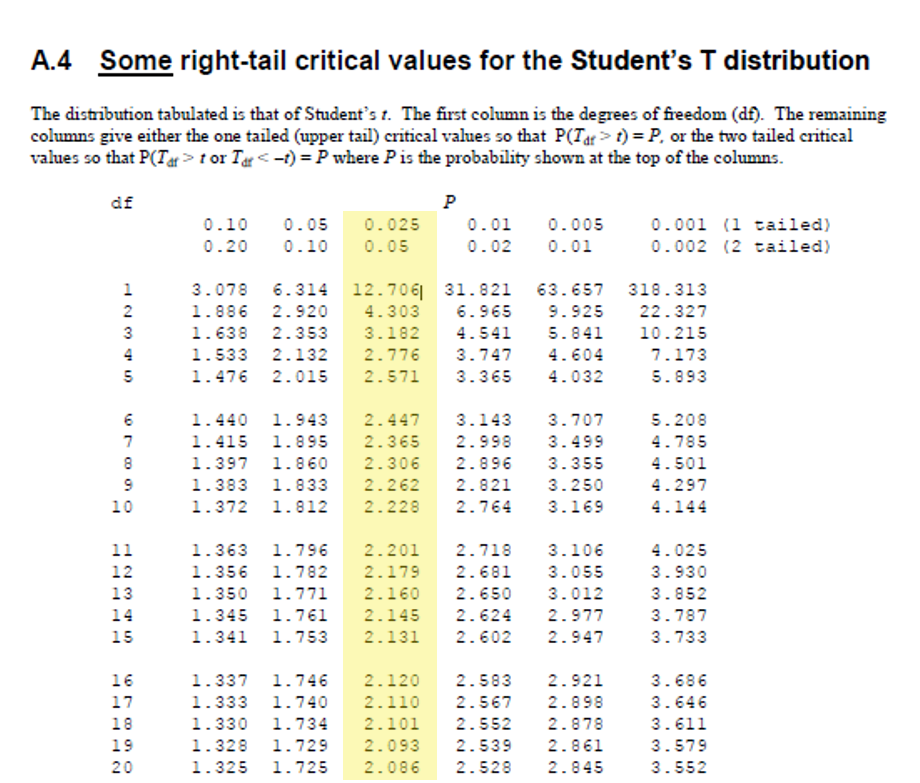

```{r, load_refs, echo=FALSE, cache=FALSE, include=FALSE}

library(RefManageR)
library(readr)
library(kableExtra)

BibOptions(check.entries = FALSE, 
           bib.style = "authoryear", 
           cite.style = 'authoryear', 
           style = "markdown",
           hyperlink = FALSE, 
           dashed = FALSE)
myBib <- ReadBib("assets/example.bib", check = FALSE)

options(knitr.kable.NA = '')
```


## Introduction

- Coordinator - **Dr. Floris van Ogtrop**; [floris.vanogtrop@sydney.edu.au](mailto:floris.vanogtrop@sydney.edu.au)
  - Room 306, Level 3, Biomedical Building, Australian Technology Park
  - (02) 8627 1024
- **Dr. Januar Harianto** - Lecturer for Topics 1, 2 & 3
  - [januar.harianto@sydney.edu.au](mailto:januar.harianto@sydney.edu.au)
- **Dr. Aaron Greenville**
- **Dr. Liana Pozza**
- **Assoc. Prof. Mathew Crowther**

???
General introduction.


---

## Student Support Services
### Free and **confidential** student services
.pull-left[

**The following services are located on Level 5, [Jane Foss Russell Building](https://goo.gl/maps/LGTj1WVzjGARDMEYA) (click me):**

- Aboriginal and Torres Strait Islander Student Support
- Careers Centre
- Child Care Information Office
- Counselling and Psychological Services (CAPS)
- Disability Services 
- Scholarships and Financial Support Service
- Student Accommodation Services
]

.pull-right[
**Other support services include:**

- Learning Centre (Level 7, Education Building) 
- Mathematics Learning Centre (Level 4, Carslaw)
- Multifaith Chaplaincy Centre (Room 164, Transient Building)

.center[

]
]

**Find out more at: [sydney.edu.au/student-services](sydney.edu.au/student-services)**


---
## Disability Services Office (02) 8627 8422

- Do you have a disability that impacts on your studies?
- You may not think of yourself as having a ‘disability’ but the definition under the Disability Discrimination Act (1992) is broad and includes temporary or chronic medical conditions, physical or sensory disabilities, psychological conditions and learning disabilities. 

- The types of disabilities we see include:
  - Anxiety // Arthritis // Asthma // Autism // ADHD
  - Bipolar disorder // Broken bones // Cancer  
  - Cerebral palsy // Chronic fatigue syndrome  
  - Crohn’s disease // Cystic fibrosis // Depression Diabetes // Dyslexia // Epilepsy // Hearing impairment // Learning disability // Mobility impairment // Multiple sclerosis // Post-traumatic stress // Schizophrenia  // Vision impairment and much more.
- In order to get assistance, students need to [register with Disability Services](sydney.edu.au/disability). It is advisable to do this as early as possible. Please contact us or review our website to find out more.


---
## About me

.pull-left[
Ecophysiologist and climate scientist


.tiny[One Tree Island]

Marine invertebrates - echinoderms


.tiny[Sea urchin]


]


.pull-right[

Rapid warming in Sydney Harbour 

(Chowder Bay logger)


]


---
## Schedule

**Lectures**
- Check Canvas for final locations
- Tuesdays, 9:00 AM - recorded (due to timetable clashes, I'm teaching upstairs!)
- Wednesdays, 9:00 AM
--


**Practicals (Labs)** at Australian Technology Park and online - see personal timetable

- 3 hours - with computers/your own personal computer
- Thu: **10am-1pm**
- Fri: **10am-1pm**, **2pm-5pm**


---
## Australia Technology Park (ATP)

.pull-left[

**Address:**

Biomedical Building (C81)

1 Central Avenue

Australian Technology Park,

Eveleigh, NSW 2015

.blockquote[
**Important !** 

- The ATP is a 30-minute walk from Carslaw Building.
- We will attempt to organise a shuttle service to coincide with classes.
]

]

.pull-right[
Wakling instructions [are here](https://goo.gl/maps/cDbgWdEufqSEZ2mS9).

.center[

]

]


---
## Outline

See weekly schedule in [UoS Outline](https://www.sydney.edu.au/units/ENVX2001/2021-S1C-ND-CC) for latest information.

```{r, echo=FALSE, message=FALSE}
read_csv("assets/envx2001_outline.csv") %>%
  kable() %>%
  # collapse_rows(columns = 1:6, valign = "top") %>%
  kable_styling(font_size = 16) %>%
  pack_rows("Part 1: Designed Studies", 1, 6) %>%
  pack_rows("Part 2: Finding Patterns in Data", 7, 12) %>%
  pack_rows("Part 3: Revision", 13, 13)
```


---
background-image: url("assets/venn.png")

## Data Science

.footnote[The Data Science Venn diagram by Drew Conway. [Source](http://drewconway.com/zia/2013/3/26/the-data-science-venn-diagram)]


---
## Big Data

.pull-left[
Mechanical stress on plant tissue

[Paper source](https://onlinelibrary.wiley.com/doi/full/10.1111/tpj.13290)


.footnote[R Code available [here](https://github.com/statnmap/blog_tips/blob/master/2018-10-28-play-with-spatial-tools-on-3d-cells-images.R).]
]

.pull-right[
Warming in Australia, 1910-2019

[Data Source](http://www.bom.gov.au/climate/change/#tabs=Tracker&tracker=timeseries)


Each stripe is one year. 
Highest temperature is 1.5 °C above the baseline 1961-90 average.

.footnote[Instructions for R [here](https://github.com/duplisea/climatestripes).]
]


---
## Learning outcomes
### (2-second preview...)
- Demonstrate proficiency in designing sample schemes and analysing data from them using using R;
- Describe and identify the basic features of an experimental design; replicate, treatment structure and blocking structure;
- Demonstrate proficiency in the use or the statistical programming language R to apply an ANOVA and fit regression models to experimental data;
- Demonstrate proficiency in the use or the statistical programming language R to use multivariate methods to find patterns in data 
- Interpret the output and understand conceptually how its derived of a regression, ANOVA and multivariate analysis that have been calculated by R;
- Write statistical and modelling results as part of a scientific report;
- Appraise the validity of statistical analyses used in publications.


---
## Learning outcomes

.center[


Do in **R**: hypothesis testing, multivariate analysis, regression modelling

]

.footnote[Image source: CRAN]


---
## Learning outcomes

.center[


Present data as reproducible reports
]

.footnote[Image source: [COVID-19 Report Dashboard](https://rpubs.com/ChenChienYi/COVID-2019Dashboard) ]


---
## Learning outcomes

.center[


Evaluate the validity of existing research 

*i.e. recognise good or bad research practices*

]

.footnote[Image source: [Why cognitive bias is a researcher’s worst enemy](https://researchdata.springernature.com/users/253354-derk-arts-md-phd/posts/53322-why-cognitive-bias-is-a-researcher-s-worst-enemy)]


---
## Assessment

.pull-left[
- Type B final exam, **not** Type C
- See exam types: [https://www.sydney.edu.au/students/exams/exam-types.html](https://www.sydney.edu.au/students/exams/exam-types.html)
]


.pull-right[

]


---
## Attendance

- Lecture attendance is not compulsory but strongly recommended as we have very interactive classes. However, lectures will be recorded in case you cannot make it.
- A minimum 80% attendance is required in workshops (tutorial + practical).
- Workshop attendance is very important for groupwork as well as learning.
- There is a strong correlation between class attendance and performance.


---
## Reference material

1. Lectures Slides
2. Practical Exercises
3. Books
  - Mead R, Curnow RN, Hasted AM (2002) Statistical methods in agriculture and experimental biology.
  - Quinn GP, Keough MJ (2002) Experimental design and data analysis for biologists. Cambridge University Press: Cambridge, UK.


---
## Extra help!

- [](https://edstem.org/) [edstem.org](https://edstem.org/) - access through Canvas
--

- Practicals and Tutorials - see Canvas
--

- Drop-in session: Mondays 11 am - 1 pm, from Week 3
--

- Appointments with lecturer 
--

- Online documentation 
  - https://stats.stackexchange.com/ - questions about stats
  - https://rseek.org/ - questions about R (also stats in R)
  - [Google](https://www.google.com) 


---
## The past, present and future

- Core for most of you:
  - 1st year:  Introduction to statistical methods (ENVX1002). Code shared with DATA1001
  - **2nd year: Applied statistical methods (ENVX2001) **
- Elective
  - 2nd or 3rd year:  Statistics in the natural sciences (ENVX3002)


---

## 

.pull-left[

- Free and open source
- Download from [CRAN](https://cran.r-project.org/)


]

.pull-right[
- More than 15,000 packages and counting


]


---
## 

.pull-left[

- Download from [RStudio website](http://www.rstudio.com/)
- Integrated Development Environment


]

.pull-right[


]


---
## Learning R


.center[]


.footnote[Source: [Adventure Time Season 1 Ep 25](https://www.imdb.com/title/tt1748408/)]


---

## Outline: Topic 1

### Designs

- Sample vs. experimental designs

### Revision

- mean, variance, standard error
- central limit theorem
- confidence intervals


---

## Outline

### Designs

- Sample vs. experimental designs

.brand-grey[

### Revision

- mean, variance, standard error
- central limit theorem
- confidence intervals
]


---
## Designs: Learning Outcomes

At the end of this topic students should be able to:

- Explain differences between 
  - samples & populations 
  - standard error & standard deviation;
--

- Describe key features of their data using 
  - summary statistics, 
  - graphical summaries and 
  - confidence intervals;
--

- Demonstrate proficiency in the use of R for calculating summary statistics and generating graphical summaries and performing 1-sample t-tests (Labs!).


---
## Designs: Why do we care?

> *“To call in a statistician after the experiment has been done may be no more than asking him to perform a post-mortem examination: he may be able to say what the experiment died of.”*
>
> Ronald Fisher

Also:
> (On a badly designed experiment).
> 
> *“That’s not an experiment you have there, that’s an experience."*
>
> Ronald Fisher

More about [R. Fisher](https://en.wikipedia.org/wiki/Ronald_Fisher).


---
## Designs: Example

.pull-left[

```{r blocked, echo=FALSE}

```

]

.pull-right[

- **Completely random design** vs. **randomised block design**.
- Treatments (A, B, and C) are randomised on the left. 
- On the right, treatments are replicated and *blocked* - each block contains one plot of each treatment.
- Shade could represent *anything* - patterns, shades, environmental factors.
]

.footnote[Designing Research and Demonstration Tests for farmers' fields. [Source](https://extension.uga.edu/publications/detail.html?number=B1177&title=Designing%20Research%20and%20Demonstration%20Tests%20for%20Farmers%27%20Fields).]

???
If you cannot anticipate.


---
## Designs: What is an experiment?

> *"...a procedure undertaken to make a discovery, test a hypothesis, or demonstrate a known fact."*
> 
> Oxford Dictionary

Two types of experiments:

```{r, echo=FALSE}
 exps <- data.frame("Controlled experiments" = c("Comparative", "Manipulative"),
   "Observational studies" = c("Absolute", "Mensurative"))

kable(exps)
```


---
## Designs: Different types of science

- Controlled experiments
- Observational studies
- Modelling
- Model development
- Methodology development


---
## Designs: A video 

.center[

<iframe width="800" height="500" src="https://www.youtube-nocookie.com/embed/G0ZZJXw4MTA" frameborder="0" allow="accelerometer; autoplay; encrypted-media; gyroscope; picture-in-picture" allowfullscreen &cc_lang_pref=fr&cc_load_policy=1></iframe>

]


---
## Revision

.brand-grey[
### Designs

- Sample vs. experimental designs


### Revision
]

- mean, variance, standard error
- central limit theorem
- confidence intervals


---
# Data Story

.pull-left[

]

..pull-right[

- Sequestered soil carbon is worth $50/tonne if measured
- It costs $100 to collect and analyse a soil sample for soil carbon
- Need an estimate of mean carbon content for property 
- Is it worth measuring for a land holder?

]

- Soil carbon content was measured at 7 points across a farm
- The amount at each location was 48, 56, 90, 78, 86, 71, 42 tonnes per hectare (t/ha)


---
## Population vs. samples

When we take a sample from a larger population...
> *What information does the sample give about the population and how reliable is that information?*

.center[

]


---
## Summary statistics

.pull-left[


- Measures of central tendency
  - Mean
  - Median
  - Mode

- Measures of spread or dispersion
  - Range
  - Interquartile range
  - Standard deviation / Variance

]

.pull-right[


.footnote[[Komorowski et al. (2016) Exploratory Data Analysis.](https://link.springer.com/chapter/10.1007/978-3-319-43742-2_15)]

]


---
## Summary statistics

.pull-left[


- Measures of central tendency
  - **Mean**
  - Median
  - Mode

- Measures of spread or dispersion
  - Range
  - Interquartile range
  - **Standard deviation / Variance**

]

.pull-right[


.footnote[[Komorowski et al. (2016) Exploratory Data Analysis.](https://link.springer.com/chapter/10.1007/978-3-319-43742-2_15)]

]


---
# Data story 

.left-column[

.small[
- Soil carbon content was measured at 7 points across a farm
- The amount at each location was 48, 56, 90, 78, 86, 71, 42 tonnes per hectare (t/ha)
]
]

.right-column[


> What is the mean soil carbon content?
>
> ----
> How confident are we that this represents the true mean?
]


---
## Arithmetric mean

- Population mean, $\mu$:  sum of all values of a variable divided by the number of objects in the population

$$\mu = \frac{\sum_{i=1}^{n}y_i} {N}$$
- Sample mean  is based on a subset of n objects from a population of size N 

$$\bar{y} = \frac{\sum_{i=1}^{n}y_i} {n}$$

> The $\Sigma$ symbol refers to the *sum*, and conveniently displays $x_1+x_2+x_3+\cdots +x_n$. 


---

# Data story 

.left-column[

.small[
- Soil carbon content was measured at 7 points across a farm
- The amount at each location was 48, 56, 90, 78, 86, 71, 42 tonnes per hectare (t/ha)
]
]

.right-column[


> What is the mean soil carbon content?

```{r}
soil <- c(48, 56, 90, 78, 86, 71, 42)
mean(soil)
```
]


---
# Data story 

.left-column[

.small[
- Soil carbon content was measured at 7 points across a farm
- The amount at each location was 48, 56, 90, 78, 86, 71, 42 tonnes per hectare (t/ha)
]
]

.right-column[


> What is the mean soil carbon content?

```{r}
soil <- c(48, 56, 90, 78, 86, 71, 42)
mean(soil)
```

> How confident are we that this represents the true mean?
]


---
# Data story
.left-column[

.small[
- Soil carbon content was measured at 7 points across a farm
- The amount at each location was 48, 56, 90, 78, 86, 71, 42 tonnes per hectare (t/ha)
]
]

.right-column[


> How confident are we that this represents the true mean?

]


---
# Data story
.left-column[

.small[
- Soil carbon content was measured at 7 points across a farm
- The amount at each location was 48, 56, 90, 78, 86, 71, 42 tonnes per hectare (t/ha)
]
]

.right-column[


> How confident are we that this represents the true mean?

```{r}
sd(soil)
length(soil)
```

Is this information enough?
]


---
## Variance and Standard Deviation (SD)

- Metrics to describe *variation* around arithmetric mean
- Variance
  - Describes variation in *squared* deviations of the mean, i.e. $unit^2$
  - Population variance: $\sigma^2 = \frac{\sum_{i=1}^{n}(y_i - \mu)^2} {N}$
  - Sample variance: $\sigma^2 = \frac{\sum_{i=1}^{n}(x_i - \mu)^2} {n-1}$
- Standard deviation
  - Describes variation in *original* units
  - Population standard deviation: $\sigma = \sqrt\frac{\sum_{i=1}^{n}(y_i - \mu)^2} {N}$
  - Sample standard variation: $\sigma = \sqrt\frac{\sum_{i=1}^{n}(y_i - \mu)^2} {n-1}$


---
## Distributions

- When we measure things, we are taking a random sample, $n$, from a larger population, $N$
- From this we calculate statistics, e.g. the mean, but if we repeatedly did this we would observe different values of the mean – this the **sampling distribution**
- Since we can only sample 1 time, what do we know about the **sampling distribution**? 


---
## Distributions

.pull-left[

- **Population** distribution -- distribution of all individuals in the population
- **Sample** distribution -- distribution of all individuals in the sample
- **Sampling** distribution -- distribution of a statistic from all possible samples

]

.pull-right[


.footnote[[Image Source](https://www.researchgate.net/figure/Population-Sample-and-Sampling-Distributions_fig2_267837095)]
]


---
## Distributions - Example

.pull-left[


.center[
Soil carbon ~ $N(70, 15^2)$
]

]

.pull-right[


.center[
Soil carbon ~ $N (70, 6.70^2)$
]

]

.center[So how well do we know the sample mean?]


---
## Standard error of the mean

- Like the standard deviation of a distribution, called standard error to avoid confusion
- Tells us how well we know the mean

$$se(\bar y) = \sqrt \frac{s^2}{n} = \frac{s}{\sqrt n}$$

- Depends on number of observations ($n$) and variation in the data ($\sigma$)


---
## Effect of sample size


.center[


Soil Carbon ~ $N(70, 15^2)$
]


---
## Effect of variation


.center[


Soil Carbon ~ $N(70, x^2)$

]


---
# Data story
.left-column[

.small[
- Soil carbon content was measured at 7 points across a farm
- The amount at each location was 48, 56, 90, 78, 86, 71, 42 tonnes per hectare (t/ha)
]
]

.right-column[


> How confident are we that this represents the true mean?

Step 1: what is the standard deviation? what is the sample size?

```{r}
sd(soil)
length(soil)
```

Step 2: what is standard error of the mean?

```{r}
sqrt(var(soil)/7) # sem manual calculation
```
]


---
## Central Limit Theorem

- If data is normally distributed then the distribution of sample means is normally distributed
- **Central limit theorem**: for almost all distributions (log, gamma), as $n$ (the sample size) increases, the distribution of sample means tends to become more normal


---
## Central Limit Theorem

.center[

]


---
## Central Limit Theorem


.center[

]


---
## Confidence intervals

- Consist of an
  - interval [lower, upper limit]
  - degree of confidence [a %, e.g. 95%]
- Definition:  informally it is the interval in which we would expect to find the population mean (μ).  More formally if we worked out a series of CIs for a series of samples, then 95% of the CIs would contain the population mean.
  - CI’s can be estimated for other parameters but so far we have only focused on the mean
  - The 95% CI for the mean is:

$$95\% CI = \bar y \pm t_{n-1}^{0.025} \times se(\bar y)$$


---
## T-probability tables

.center[

]


---
## T-probability tables

```{r eval=FALSE}
qt(α/2,degrees of freedom) # pseudo-code
```

--

Example:

> Find the upper 2.5th percentile of the Student t distribution with 10 degrees of freedom.

```{r}
qt(c(.025), df = 10)
```


---
# Data story

.left-column[

.small[
- Soil carbon content was measured at 7 points across a farm
- The amount at each location was 48, 56, 90, 78, 86, 71, 42 tonnes per hectare (t/ha)
]
]

.right-column[


> How confident are we that this represents the true mean?

```{r}
t.test(soil)
```

]


---
class: center, middle

# Thanks!

Slides created via the R package [**xaringan**](https://github.com/yihui/xaringan).


---
## References

- ENVX1002 Manual
- Quinn & Keough (2002)
  - Chapter 1, Chapter 2: Sections 2.1-2.3
- Mead et al. (2002).
  - Chapter 1-2, Chapter 3: Sections 3.1-3.3.

